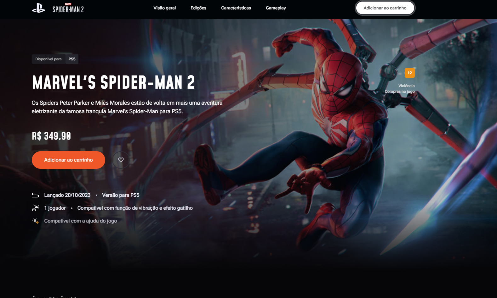

<h1 align="center"> Devprocess </h1>

  <a href="#-tecnologias">Tecnologias</a>&nbsp;&nbsp;&nbsp;|&nbsp;&nbsp;&nbsp;
  <a href="#-projeto">Projeto</a>&nbsp;&nbsp;&nbsp;|&nbsp;&nbsp;&nbsp;
  <a href="#memo-licença">Licença</a>

  

 

  

## 🚀 Tecnologias

Esse projeto foi desenvolvido com as seguintes tecnologias:

- HTML e CSS
- JavaScript
- Git e Github
- Figma

## 💻 Projeto

O Devpprocess landing page.

- [Acesse o projeto finalizado, online](https://devprocess.vercel.app/)

- [Assistir aulas](https://www.youtube.com/watch?v=nAf2wbHNKN0&t=2540s)

## :memo: Licença

Esse projeto está sob a licença MIT.

---
Tutorial reproduzido [Pedro Germano](https://www.linkedin.com/in/pedrogermano232/)  
Creditos [Codeboost | Devprocess](https://discord.gg/rocketseat)